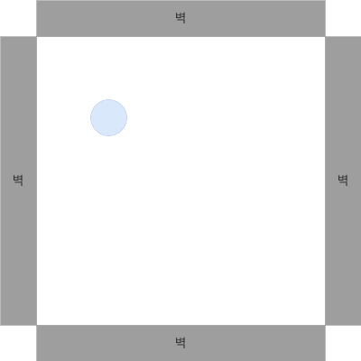
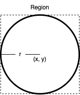
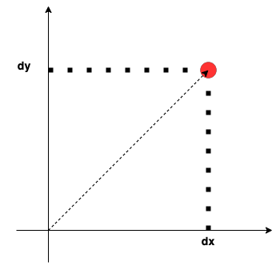
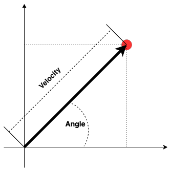
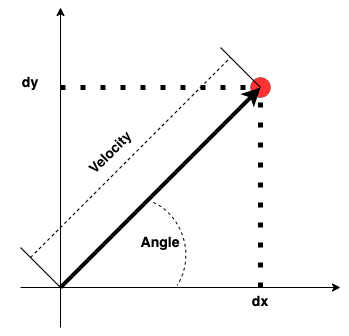

# Module02

[TOC]

## 지난 수업

지난 수업에서는 아래의 내용에 대해 진행하였다.

* 각종 기본 클래스 정의
  * Point, Ball, MovableBall, Region, BallWorld,  MovableWorld, BoundedWorld
* 공간내에서 볼의 이동
* Rectangle.intersects 함수를 이용한 BoundedWorld 벽 충돌 감지
  *  BoundedWorld와 Ball간 교차 영역이 없는 경우, 벽 충돌로 정의함
* 충돌 감지 후 튕김

**문제점**

* 공의 크기에 따라 BoundedWorld의 Region 계산 필요

  

## 벽으로 막혀 있는 공간 BoundedBallWorld

BoundedBallWorld은 사각의 공간이면서 4면이 모두 벽으로 막혀져 있다. 볼은 공간내에서 자유롭게 움직일 수 있지만, 벽에 부딪히면 딩겨져 나온다.

볼과 벽의 충돌은 아래와 같은 원리로 검출 가능하다.

* 볼은 지름 크기의 폭과 높이를 갖는 Region을 갖는다

* BoundedBallWorld을 둘러 싸고 있는 4개의 면에는 폭이나 높이가 무한대인 벽이 세워져 있다.
  * 벽의 두께는 단위 시간에 볼이 움직일 수 있는 최대 거리이하면 문제가 될 수 있다
  
  * 벽의 두께는 단위 시간동안 공이 이동할 수 있는 최대 거리보다 크면 된다.
  
  
  
* Ball과 벽의 충돌 감지는 awt.Rectangle에서 지원하는 intersects 함수로 구현 가능하다

### 문제 1-1. BallWorld 4면에 벽을 생성하라.

### 고, 벽에 충돌이 감지될 경우 볼의 방향을 변경하라. (15분)

## 볼의 이동 (Motion)

### 문제 2. Module 속도와 각도 또는 X축과 Y축의 변화량을 사용한 볼의 이동량을 Motion 클래스를 정의하여 사용하라

 #### 문제 2-1 Motion클래스에 X축 이동량과 Y축 이동량을 갖도록 추가로 정의하라.(10분)

~~~java
package org.nhnacademy.ballworld;

/**
 * Motion 클래스는 좌표의 이동량을 나타낸다.
 * 

 * 이동량은 X축과 Y축의 이동량으로 표시될 수 있다.
 */
public class Motion {
    /**
     * X축으로의 변화량.
     */
    ...

    /*
     * Y축으로의 변화랑.
     */
    ...

    /**
     * X축 이동량 0, Y축 이동량 0로 생성.
     */
    public Motion() {
     ... 
    }

    /**
     * X축과 Y축의 이동량으로 설정한다.
     * 

     * 속도와 각도 정보는 자동으로 변경된다.
     * @param dx
     * @param dy
     */
    public void setDXDY(double dx, double dy) {
	    ...
    }

    public double getDX() {
	    ...
    }

    /**
     * X축 이동량을 설정한다.
     * 

     * 속도와 각도 정보는 자동으로 변경된다.
     * @param dx
     */
    public void setDX(double dx) {
	    ...
    }

    /**
     * X축 이동량에 주어진 이동량을 추가한다.
     * 

     * 속도와 각도 정보는 자동으로 변경된다.
     * @param dx
     */
    public void addDX(double dx) {
	    ...
    }

    /**
     * X축 이동량을 반대로 변경한다.
     */
    public void turnX() {
	    ...
    }

    public double getDY() {
	    ...
    }

     /**
     * Y축 이동량을 설정한다.
     * 

     * 속도와 각도 정보는 자동으로 변경된다.
     * @param dy
     */
    public void setDY(double dy) {
	    ...
    }

    /**
     * Y축 이동량에 주어진 이동량을 추가한다.
     * 

     * 속도와 각도 정보는 자동으로 변경된다.
     * @param dy
     */
    public void addDY(double dy) {
	    ...
    }

    /**
     * Y축 이동량을 반대로 변경한다.
     */
    public void turnY() {
	    ...
    }
}

~~~

테스트 코드는 아래와 같습니다.

~~~java
package test;

import org.nhnacademy.ballworld.Motion;;
public class TestMotion {
    public static void main(String[] args) {
        Motion motion = new Motion();

        motion.setDXDY(0, 0);
        System.out.println("SetDXDY => DX : " + motion.getDX() 
                           + ", DY : " + motion.getDY());
        for(int x = 1 ; x < 5 ; x++) {
            motion.addDX(1);
            motion.setDY(0);
            for(int y = 1 ; y < 5 ; y++) {
                motion.addDY(1);
                System.out.println("DX : " + motion.getDX() 
                                   + ", DY : " + motion.getDY());
            }
        }
        motion.setDXDY(1, 2);
        System.out.println("SetDXDY => DX : " + motion.getDX() + ", DY : " 
                           + motion.getDY());
        motion.turnX();
        System.out.println("turnX => DX : " + motion.getDX() + ", DY : " 
                           + motion.getDY());
        motion.turnY();
        System.out.println("turnY => DX : " + motion.getDX() + ", DY : " 
                           + motion.getDY());
        motion.turnX();
        System.out.println("turnX => DX : " + motion.getDX() + ", DY : " 
                           + motion.getDY());
        motion.turnY();
        System.out.println("turnY => DX : " + motion.getDX() + ", DY : " 
                           + motion.getDY());

    }

}

~~~

 #### 문제 2-2 Motion 클래스에 속도와 각도를 갖도록 정의하라.(10분)

~~~java
package org.nhnacademy.ballworld;

/**
 * Motion 클래스는 좌표의 이동량을 나타낸다.
 * 

 * 이동량은 속도와 각도 또는 X축과 Y축의 이동량으로 표시될 수 있다.
 */
public class Motion {
    /**
     * 속도.
     */
		...
  
    /**
     * 각도.
     */
		...

    /**
     * X축으로의 변화량.
     */
		...

    /*
     * Y축으로의 변화랑.
     */
		...

    /**
     * 속도 0, 각도 0 또는 X축 이동량 0, Y축 이동량 0로 생성.
     */
    public Motion() {
			...

    }

    /**
     * 속도와 각도 정보로 Motion 생성.
     * @param velocity 속도
     * @param angle 각도
     */
    public Motion(double velocity, double angle) {
			...
    }

    /**
     * 속도 정보.
     * @return
     */
    public double getVelocity() {
			...
    }

    /**
     * 속도 정보 변경으로 X축과 Y축의 이동량도 변경된다.
     * @param velocity
     */
    public void setVelocity(double velocity) {
			...
    }

    public void addVelocity(double velocity) {
			...
    }
    /**
     * 각도.
     * @return
     */
    public double getAngle() {
			...
    }

    /**
     * 각도 변경으로 X축과 Y축의 이동량도 변경된다.
     * @param angle 각도
     */
    public void setAngle(double angle) {
			...
    }

    public void addAngle(double angle) {
			...
    }

    /**
     * X축과 Y축의 이동량으로 설정한다.
     * 

     * 속도와 각도 정보는 자동으로 변경된다.
     * @param dx
     * @param dy
     */
    public void setDXDY(double dx, double dy) {
			... 	// 앞에서 구현함
		}

    public double getDX() {
			... 	// 앞에서 구현함
    }

    /**
     * X축 이동량을 설정한다.
     * 

     * 속도와 각도 정보는 자동으로 변경된다.
     * @param dx
     */
    public void setDX(double dx) {
			... 	// 앞에서 구현함
    }

    /**
     * X축 이동량에 주어진 이동량을 추가한다.
     * 

     * 속도와 각도 정보는 자동으로 변경된다.
     * @param dx
     */
    public void addDX(double dx) {
			... 	// 앞에서 구현함
    }

    /**
     * X축 이동량을 반대로 변경한다.
     */
    public void turnX() {
			... 	// 앞에서 구현함
    }

    public double getDY() {
			... 	// 앞에서 구현함
    }

     /**
     * Y축 이동량을 설정한다.
     * 

     * 속도와 각도 정보는 자동으로 변경된다.
     * @param dy
     */
    public void setDY(double dy) {
			... 	// 앞에서 구현함
    }

    /**
     * Y축 이동량에 주어진 이동량을 추가한다.
     * 

     * 속도와 각도 정보는 자동으로 변경된다.
     * @param dy
     */
    public void addDY(double dy) {
			... 	// 앞에서 구현함
    }

    /**
     * Y축 이동량을 반대로 변경한다.
     */
    public void turnY() {
			... 	// 앞에서 구현함
    }
}

~~~

테스트 코드는 아래와 같습니다.

~~~java
package test;

import org.nhnacademy.ballworld.Motion;;
public class TestMotion {
    public static void main(String[] args) {
        Motion motion = new Motion();

        motion.setDXDY(0, 0);
        System.out.println("SetDXDY => DX : " + motion.getDX() 
                           + ", DY : " + motion.getDY());
        for(int x = 1 ; x < 5 ; x++) {
            motion.addDX(1);
            motion.setDY(0);
            for(int y = 1 ; y < 5 ; y++) {
                motion.addDY(1);
                System.out.println("DX : " + motion.getDX() 
                                   + ", DY : " + motion.getDY());
            }
        }
        motion.setDX(1);
        motion.setDY(2);
        System.out.println("SetDXDY => DX : " + motion.getDX() + ", DY : " 
                           + motion.getDY());
        motion.turnX();
        System.out.println("turnX => DX : " + motion.getDX() + ", DY : " 
                           + motion.getDY());
        motion.turnY();
        System.out.println("turnY => DX : " + motion.getDX() + ", DY : " 
                           + motion.getDY());
        motion.turnX();
        System.out.println("turnX => DX : " + motion.getDX() + ", DY : " 
                           + motion.getDY());
        motion.turnY();
        System.out.println("turnY => DX : " + motion.getDX() + ", DY : " 
                           + motion.getDY());

        for(double velocity = 1 ; velocity <= 5 ; velocity += 1.0) {
            motion.setVelocity(velocity);
            for(double angle = 0 ; angle <= 90 ; angle += 10) {
                motion.setAngle(angle);

                System.out.println("(속도, 각도) = (" + motion.getvelocity() 
                                   + ", " + motion.getAngle() + ")");
            }
        }

        motion.setvelocity(0);
        motion.setAngle(0);
        System.out.println("(속도, 각도) = " + motion);

        for(int i = 0 ; i < 5 ; i ++ ) {
            motion.addvelocity(1);
            motion.setAngle(0);
            for(int j = 0 ; j < 9 ; j ++) {
                motion.addAngle(10);

                System.out.println("(속도, 각도) = (" + motion.getvelocity() 
                                   + ", " + motion.getAngle() + ")");
            }
        }

~~~

#### 문제 2-3 Motion을 설정하는 두가지 방법을 정의 하였다. 두가지 방법중 어느 방법을 사용하더라도 Motion이 동일하게 동작하도록 기능을 추가로 정의하라.(10분)

**참고**

속도와 각도를 이용해 dx와 dy를 구하는 식은 아래와 같다.

* dx = velocity * cos(angle)
* dy = velocity * sin(angle)

코드는 아래와 같다.

~~~java
        double radian = Math.toRadians(angle);
        dx = velocity * Math.cos(radian);
        dy = velocity * Math.sin(radian);
~~~

 X축 이동량(dx)와 Y측 이동량(dy)를 이용해 속도와 각도를 구하는 식은 아래와 같다.

* velocity = sqrt(dx \* dx + d y\* dy)
* angle = arcsin(dy / velocity)

코드는 아래와 같다.

~~~java
        this.velocity = Math.sqrt(Math.pow(dx, 2) + Math.pow(dy, 2));
        this.angle = Math.toDegrees(Math.asin(dy / this.velocity));
~~~

~~~java
package org.nhnacademy.ballworld;

/**
 * Motion 클래스는 좌표의 이동량을 나타낸다.
 * 

 * 이동량은 속도와 각도 또는 X축과 Y축의 이동량으로 표시될 수 있다.
 */
public class Motion {
    /**
     * 속도.
     */
		...
        
    /**
     * 각도.
     */
		...

    /**
     * X축으로의 변화량.
     */
		...

    /*
     * Y축으로의 변화랑.
     */
		...

    /**
     * 속도 0, 각도 0 또는 X축 이동량 0, Y축 이동량 0로 생성.
     */
    public Motion() {
			...
    }

    /**
     * 속도와 각도 정보로 Motion 생성.
     * @param velocity 속도
     * @param angle 각도
     */
    public Motion(double velocity, double angle) {
			...

    }

    /**
     * 속도 정보.
     * @return
     */
    public double getVelocity() {
			...
    }

    /**
     * 속도 정보 변경으로 X축과 Y축의 이동량도 변경된다.
     * @param velocity
     */
    public void setVelocity(double velocity) {
			...
    }

    public void addVelocity(double velocity) {
			...
    }
    /**
     * 각도.
     * @return
     */
    public double getAngle() {
			...
    }

    /**
     * 각도 변경으로 X축과 Y축의 이동량도 변경된다.
     * @param angle 각도
     */
    public void setAngle(double angle) {
			...
    }

    public void addAngle(double angle) {
			...
    }

    /**
     * X축과 Y축의 이동량으로 설정한다.
     * 

     * 속도와 각도 정보는 자동으로 변경된다.
     * @param dx
     * @param dy
     */
    public void setDXDY(double dx, double dy) {
			...
    }

    public double getDX() {
        return  dx;
    }

    /**
     * X축 이동량을 설정한다.
     * 

     * 속도와 각도 정보는 자동으로 변경된다.
     * @param dx
     */
    public void setDX(double dx) {
			...
    }

    /**
     * X축 이동량에 주어진 이동량을 추가한다.
     * 

     * 속도와 각도 정보는 자동으로 변경된다.
     * @param dx
     */
    public void addDX(double dx) {
			...
    }

    /**
     * X축 이동량을 반대로 변경한다.
     */
    public void turnX() {
			...
    }

    public double getDY() {
        return dy;
    }

     /**
     * Y축 이동량을 설정한다.
     * 

     * 속도와 각도 정보는 자동으로 변경된다.
     * @param dy
     */
    public void setDY(double dy) {
			...
    }

    /**
     * Y축 이동량에 주어진 이동량을 추가한다.
     * 

     * 속도와 각도 정보는 자동으로 변경된다.
     * @param dy
     */
    public void addDY(double dy) {
			...
    }

    /**
     * Y축 이동량을 반대로 변경한다.
     */
    public void turnY() {
			...
    }

    /**
     * 속도 또는 각도가 변경된 경우, X축과 Y축의 이동량을 변경한다.
     */
    protected void updateDXDY() {
        double radian = Math.toRadians(angle);
        dx = velocity * Math.cos(radian);
        dy = velocity * Math.sin(radian);
    }

    /**
     * X축과 Y축 이동량 변경시 호출하여 속도와 각도를 변경한다.
     */
    protected void updatevelocityAndAngle() {
			...
    }

    @Override
    public String toString() {
        return  "(" + velocity + ", " + angle + ")";
    }
}

~~~

테스트 코드는 아래와 같다.

~~~java
package test;

import org.nhnacademy.ballworld.Motion;

public class TestMotion {
    public static void main(String[] args) {
        Motion motion = new Motion();

        for(double velocity = 1 ; velocity <= 5 ; velocity += 1.0) {
            motion.setVelocity(velocity);
            for(double angle = 0 ; angle <= 90 ; angle += 10) {
                motion.setAngle(angle);

                System.out.println("(거리, 각도) = (" + motion.getVelocity() + ", " 
                                   + motion.getAngle() + ")");
            }
        }

        motion.setVelocity(0);
        motion.setAngle(0);
        System.out.println("(거리, 각도) = " + motion);

        for(int i = 0 ; i < 5 ; i ++ ) {
            motion.addVelocity(1);
            motion.setAngle(0);
            for(int j = 0 ; j < 9 ; j ++) {
                motion.addAngle(10);

                System.out.println("(거리, 각도) = (" + motion.getVelocity() 
                                   + ", " + motion.getAngle() + ")");
            }
        }

        motion.setDXDY(0, 0);
        System.out.println("SetDXDY => DX : " + motion.getDX() 
                           + ", DY : " + motion.getDY());
        for(int x = 1 ; x < 5 ; x++) {
            motion.addDX(1);
            motion.setDY(0);
            for(int y = 1 ; y < 5 ; y++) {
                motion.addDY(1);
                System.out.println("DX : " + motion.getDX() 
                                   + ", DY : " + motion.getDY());
            }
        }
        motion.setDX(1);
        motion.setDY(2);
        System.out.println("SetDXDY => DX : " + motion.getDX() 
                           + ", DY : " + motion.getDY());
        motion.turnX();
        System.out.println("turnX => DX : " + motion.getDX() 
                           + ", DY : " + motion.getDY());
        motion.turnY();
        System.out.println("turnY => DX : " + motion.getDX() 
                           + ", DY : " + motion.getDY());
        motion.turnX();
        System.out.println("turnX => DX : " + motion.getDX() 
                           + ", DY : " + motion.getDY());
        motion.turnY();
        System.out.println("turnY => DX : " + motion.getDX() 
                           + ", DY : " + motion.getDY());

        for(int x = 1 ; x < 5 ; x++) {
            motion.addDX(1);
            for(int y = 1 ; y < 5 ; y++) {
                motion.addDY(1);
                System.out.println("DX : " + motion.getDX() 
                                   + ", DY : " + motion.getDY()
                        					 + ", Velocity : " + motion.getVelocity() 
                                   + ", Angle : " + motion.getAngle());
            }
        }

        for(int velocity = 1 ; velocity < 5 ; velocity++) {
            motion.setVelocity(velocity);
            for(int angle = 10 ; angle < 90 ; angle += 10) {
                motion.setAngle(angle);
                System.out.println( "Velocity : " + motion.getVelocity() 
                                   	+ ", Angle : " + motion.getAngle()
                    								+ ", DX : " + motion.getDX() 
                                   	+ ", DY : " + motion.getDY());
            }
        }
    }
}

~~~

## 외부 영향(중력, 바람, 매질, ...)

### 문제 3. MovableBall클래스를 확장하여 중력의 영향을 받는 CannonBall 클래스를 정의하라.

지구에서는 하늘로 쏘아 올릴 경우, 중력에 의해 땅으로 떨어진다. CannonBall도  이와 마찬가지로 위로 쏘아 올릴 경우, 일정 시간이 지나면 땅으로 떨어져 움직임을 멈춘다. 반지름 20인 볼을 (x, y) = (20, 20)에 두고, (dx, dy) = (15, 15)로 움직이도록 motion을 설정하여 쏠 경우,  중력이 없는 환경에서는 볼을 계속해서 비스듬하게 하늘로 올라가지만, 중력이 존재할 경우 포물선을 그리면 땅으로 떨어질 것이다.

MovableBall을 확장하여 중력의 영향을 받는 CannonBall을 정의한다.

~~~java
package org.nhnacademy.ballworld;

import java.awt.Color;

public class CannonBall extends MovableBall {
    /**
     * 중력
     */
    ...

    public CannonBall(Point location, double radius, Color color) {
        super(location, radius, color);
        this.gravity = 0;
    }

    public CannonBall(Point location, double radius) {
      ...
    }

    /**
     * 
     * @param gravity
     */
    public void setGravity(double gravity) {
      ...
    }

    /**
     * 
     * @return
     */
    public double getGravity() {
			...
    }

    /**
     * 볼을 이동하고, 볼이 바닥에 닿은 경우 움직임을 멈춘다.
     */
    @Override
    public void move() {
			...
    }
}

~~~

문제 2와 동일한 코드에서 볼만 MovableBall에서 CannonBall로 변경하고, 볼의 생성 위치를 (20, 20), 반지름을 20으로 하여 테스트해 본다.

결과를 확인하고 이상한 점을 말해 보자.

## 기능의 분리(MVC 모델)

#### 문제 4-1. 상하 좌표계를 반전시켜라.

문제 3에서 테스트 결과 볼의 위치와 진행방향이 의도한 바와 다르게 나타난다. 이윤느 화면상의 좌표계는 상하가 반전되어 있어 (0,0)이 좌측 상단이 된다. 일반적으로 생각하는 좌측 하단에서 (0, 0)이 되도록 수정하라.

~~~java
package org.nhnacademy.ballworld;

import java.awt.Color;
import java.awt.Graphics;

public class Ball {
		...

    public Ball(Point location, double radius, Color color, int height) {
      ...    
    }

    public Ball(Point locPoint, double raduis, int height) {
      ...
    }

	...
}

~~~

수정 방법은 Ball에게 BallWorld의 높이 정보를 제공하고, Ball을 그릴때 반전 시켜 줌으로써 해결 가능하다. 하지만, 여기에는 몇가지 생각해 볼 점들이 있다.

* Ball이 BallWorld의 공간 정보를 가지는게 옳은가?
* 현재는 반전만 있지만, 회전이나 비율 변경이 필요하다면?

#### 문제 4-2. BallWorld에서 화면 구성만 분리하여 View를 분리하라.

BallWorld는 Frame의 확장을 통해 화면을 구성된다. 여기서 화면 구성 관련된 부분을 Frame에서 확장된 BallWorldView로 구성하고 BallWorld는 일반 클래스로 구성 후 BallWorldView클래스를 이용하도록 변경한다.

#### 문제 4-3. View를 제외한 나머지 클래스에서의 그리기 작업을 제거하고, View에서 처리할 수 있도록 수정하라.

Ball을 그리는 작업은 Ball 클래스 내에서 수행하였다. 이를 수정하여 Ball 그리는 작업을 View에서 수행하도록 수정하고, 그리기 작업에 필요한 정보는 BallWorld 클래스에서 얻어 갈 수 있도록 수정하라.

#### 문제 4-4. View에서 Ball을 사각형으로 표현하도록 수정하라.

 Ball 클래스에서는 Ball을 원형으로 표현하였다. 새롭게 정의한 View에서는 Ball을 사각형으로 표시하라.

#### 문제 4-5. View의 크기를 가상 공간 크기와 실제 공간 크기로 설정하고, Ball 정보를 가상 공간의 크기로 적용하여 화면에 출력되도록 수정하라.

View에 가상 좌표계를 도입하고, 실제 화면 크기와 다른 비율로 가상 좌표계를 설정한 후 볼을 가상 좌표계에서 표현하라.

## 다양한 모형

#### 문제 5-1. Box 추가하기

BallWorld에는 둥근형태의 Ball만 존재한다. 여기에, 사각형이 Box를 추가하라. Box를 Ball과 같이 움직이지는 않는다.

#### 5-2. 움직이는 MovableBox추가하기

